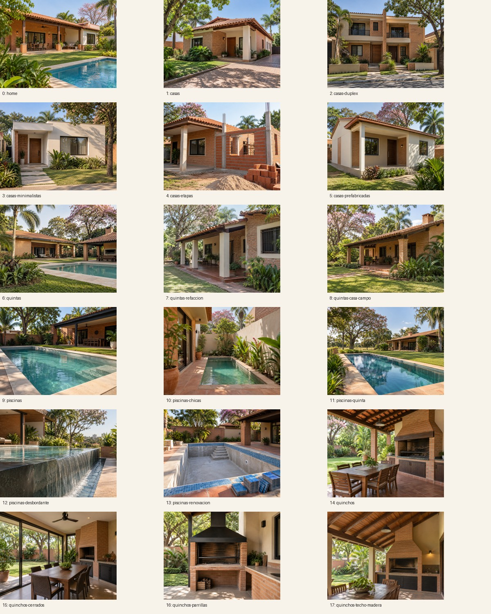
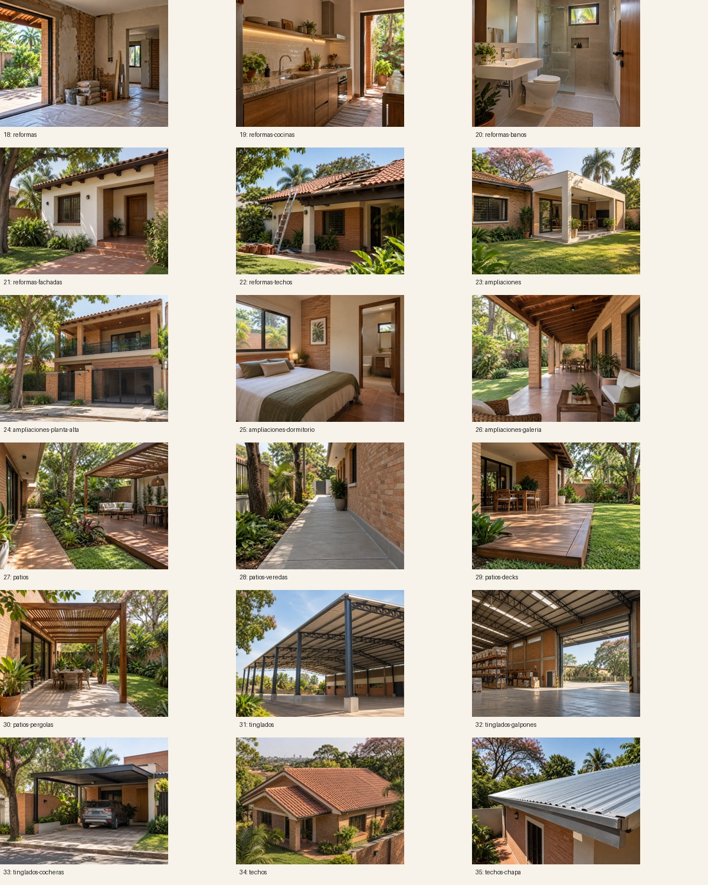
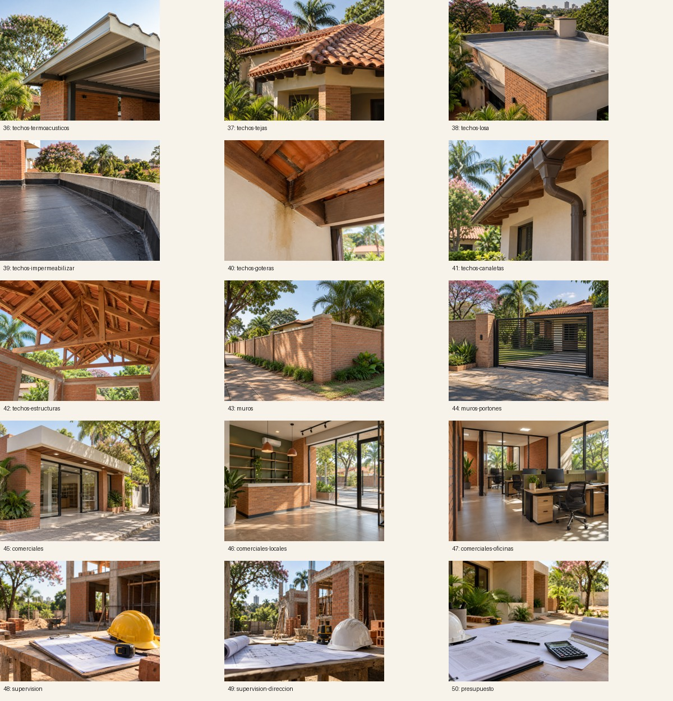

# Generated reference photographs

51 separate Higgsfield GPT Image 2.5 Sunburst / medium / 1k images cover the homepage, 13 service hubs and 37 specialties. All are **generated service references**, not completed Obra projects or engineering documentation. Public image notices were removed at the owner’s request. Generation provenance remains documented here; the project-evidence renderer rejects this asset directory.

The visual brief uses Paraguay context: low-rise rendered/brick masonry, shade, local clay-tile and sheet-metal roofing, galerías, quinchos and subtropical vegetation. Images were visually reviewed in these labeled contact sheets:

`reference-images.json` records model, settings, prompts, generation job IDs and asset hashes. Original PNGs remain local in ignored `.image-source/sunburst/`; public assets have 480/960/1200px WebP versions. To rebuild sizes, restore those originals using the recorded job IDs and run `tools/prepare-reference-images.py` with Python/Pillow. This script optimizes and normalizes dimensions; it does not invent new imagery or spend credits.

Budget record: 35 Recraft explorations at the quoted 1.25 credits/image plus 51 final Sunburst images at 0.5 credits/image = **69.25 estimated credits**, under the owner's **100-credit maximum**. The final Sunburst set's 25.5-credit debit matches the observed account balance change during that set. Rejected rate-limit submissions did not create jobs. No additional paid generation is scheduled.
