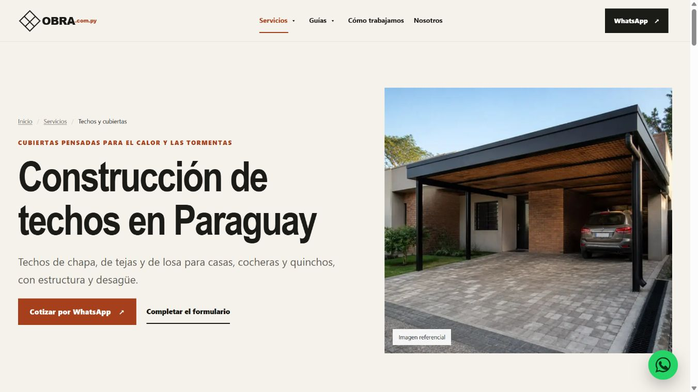
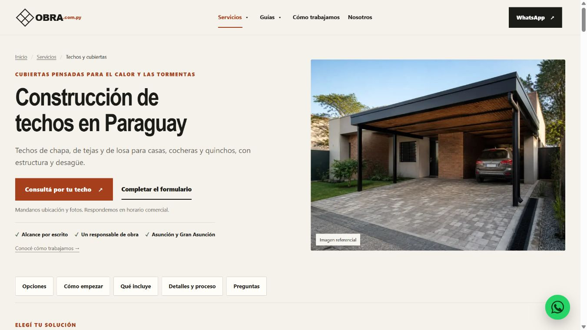
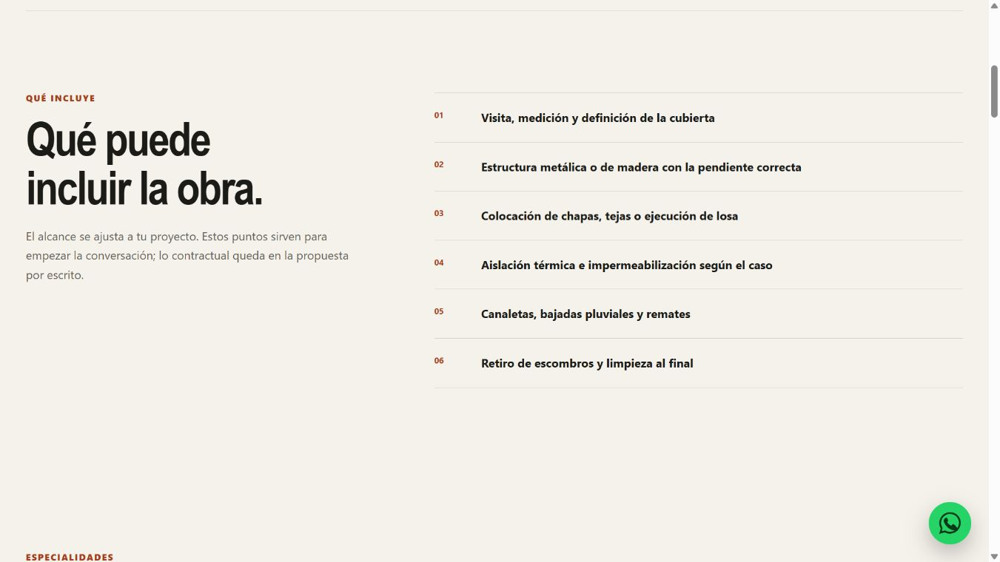
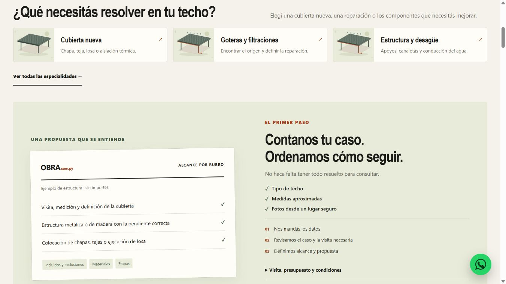
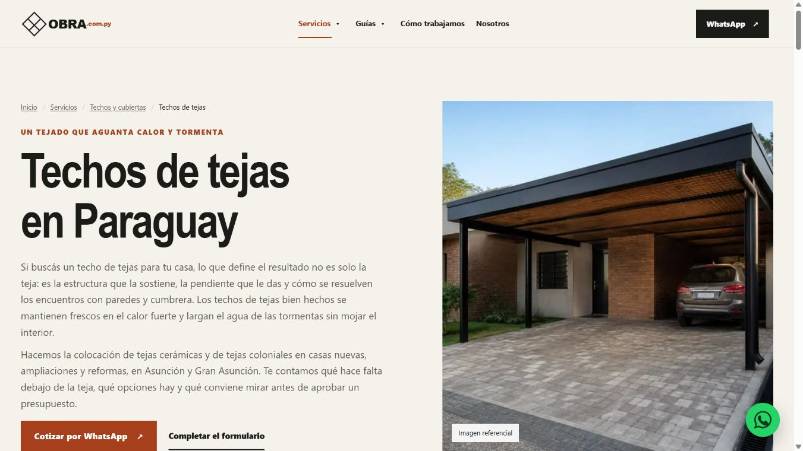
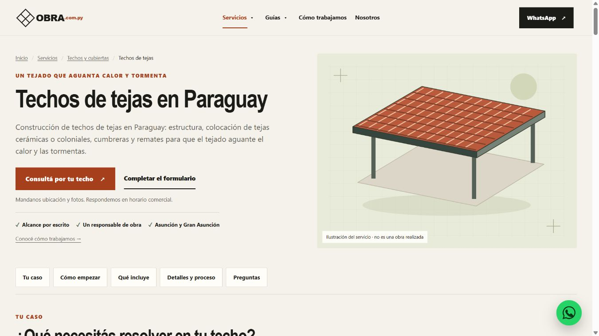

# Live before / PR build after

Captured on **2026-10-04, approximately 20:16–20:18 America/Asuncion (UTC−03:00)**, before deployment of PR #21.

**Before** images are from the actual public `https://obra.com.py` site. **After** images are from the PHP preview at `http://127.0.0.1:8086`, running the PR branch at `fb2f129`. These are screenshots of rendered pages, not mockups. Production was not changed.

Both versions used the same browser and viewport overrides: desktop 1366×768 and mobile 390×844. Native browser captures include the visible scrollbar; rendered image dimensions can differ slightly from the requested viewport. The section-two captures use one downward page scroll, so they compare the same browsing action rather than an identical content position.

| Page / view | Current live site | New PR build |
|---|---|---|
| Roofing hub, desktop opening | [Before](before-techos-desktop.jpg) | [After](after-techos-desktop.jpg) |
| Roofing hub, desktop after scrolling | [Before](before-techos-desktop-section2.jpg) | [After](after-techos-desktop-section2.jpg) |
| Roofing hub, mobile opening | [Before](before-techos-mobile.jpg) | [After](after-techos-mobile.jpg) |
| Tile-roof specialty, desktop opening | [Before](before-tejas-desktop.jpg) | [After](after-tejas-desktop.jpg) |
| Tile-roof specialty, mobile opening | [Before](before-tejas-mobile.jpg) | [After](after-tejas-mobile.jpg) |

## Opening comparison

| Current live site | New PR build |
|---|---|
|  |  |

## Next-section comparison

| Current live site | New PR build |
|---|---|
|  |  |

## Specialty comparison

| Current live site | New PR build |
|---|---|
|  |  |

For a post-deployment check, capture the same public URLs at these settings and compare them with the archived PR-build images. The archive preserves what was live before release even after production changes.
